<div align="center">
Guía Técnica: Despliegue de Entorno de Pruebas para Auditoría de Identidad


> **Laboratorio académico de ingeniería social y simulación de captura de credenciales.** 
> Entorno controlado, aislado y con fines exclusivamente educativos.
---
</div>
Declaración Ética
> [!WARNING]
> Este repositorio documenta un procedimiento técnico desarrollado en un **entorno de laboratorio aislado**, con fines académicos y de investigación en ciberseguridad. El autor **no se hace responsable** por el uso indebido de las herramientas aquí documentadas. El uso de estas técnicas fuera de un marco académico o profesional autorizado puede constituir un **delito informático** conforme a la legislación vigente.
---
Tabla de Contenidos
Preparación del Entorno
Configuración de la Herramienta
Parámetros de Simulación
Integración con VTXHub y Vortex
---
1. Preparación del Entorno
La fase inicial consiste en preparar un entorno de trabajo aislado y reproducible para la ejecución de herramientas de auditoría. El uso de Git asegura la descarga de la versión actualizada del código desde el repositorio oficial.
Paso	Descripción
Clonación	Descarga del repositorio mediante `git clone` desde la fuente oficial
Entorno Virtual	Aislamiento de dependencias con `venv` para evitar conflictos de versiones
Instalación	Carga de librerías requeridas dentro del entorno aislado
Clonar el repositorio
```bash
git clone https://gitlab.com/An0nUD4Y/hiddeneye.git
cd hiddeneye
```
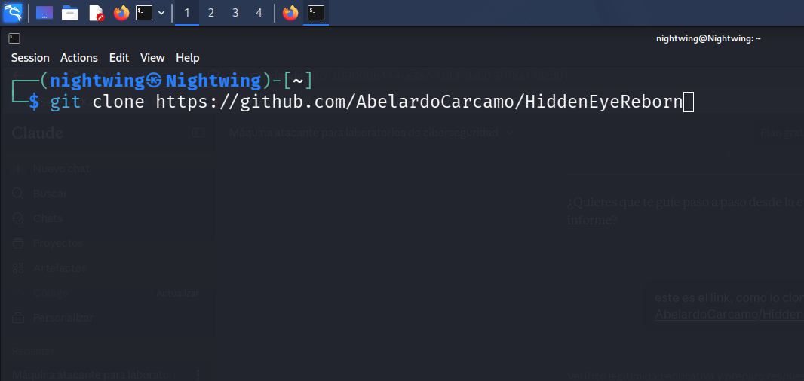
Figura 1 — Clonación del repositorio HiddenEye desde GitLab.
Instalar dependencias
```bash
python3 -m venv venv
source venv/bin/activate
pip install requests
```
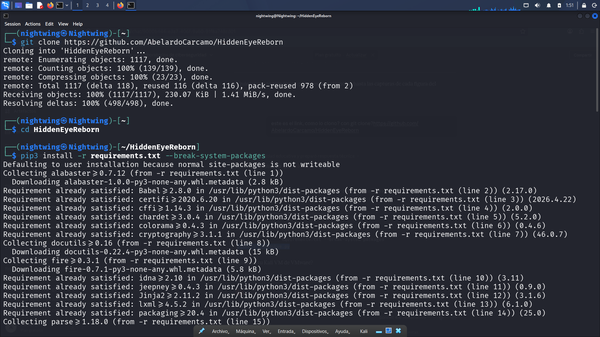
Figura 2 — Instalación de dependencias dentro del entorno virtual.
---
2. Configuración de la Herramienta
Tras inicializar HiddenEye, la herramienta verifica el entorno y presenta su menú principal. Es estrictamente necesario aceptar los términos de uso ético antes de continuar, confirmando que el software se emplea únicamente en entornos de laboratorio autorizados.
```bash
sudo python3 HiddenEye.py
```
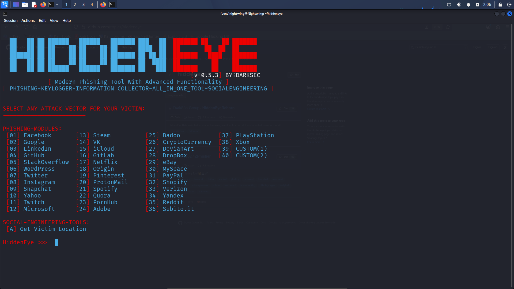
Figura 3 — Menú principal de HiddenEye con los módulos de simulación disponibles.
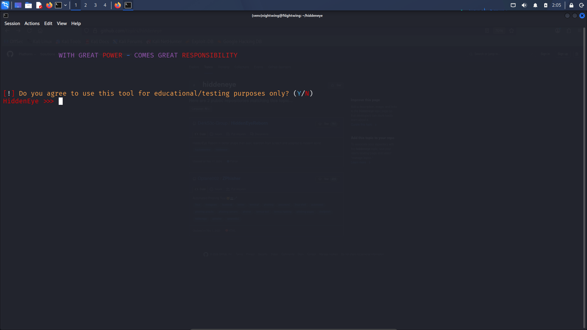
Figura 4 — Confirmación del disclaimer de seguridad y uso responsable.
Módulos disponibles
Selección de objetivo — Elegir el servicio a emular (`21` para Spotify en este laboratorio)
Plantilla estándar — Página de inicio de sesión de alta fidelidad visual
Protecciones opcionales — Técnicas de evasión ante medidas de seguridad del sitio objetivo
---
3. Parámetros de Simulación
En esta fase se definen los parámetros de recolección y el flujo de navegación del usuario objetivo dentro del entorno controlado.
---
3.1 Persistencia — Keylogger
Activación del registro de pulsaciones en tiempo real, permitiendo la captura de credenciales incluso antes de la confirmación del formulario.
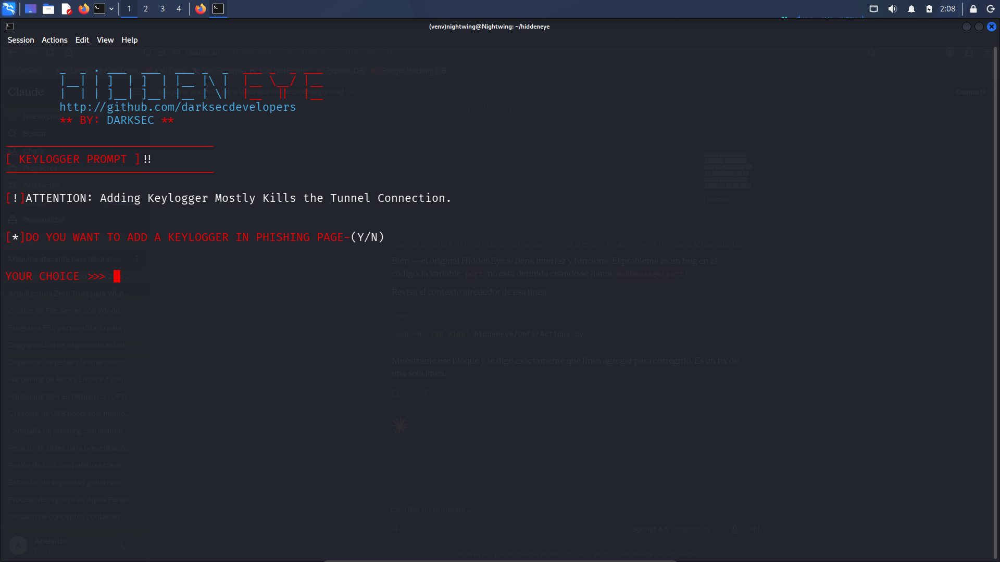
Figura 5 — Activación del keylogger integrado en la página de phishing.
---
3.2 Redirección Post-Captura
Configuración de la URL de destino final hacia la que es redirigido el usuario tras interactuar, reduciendo la probabilidad de detección.
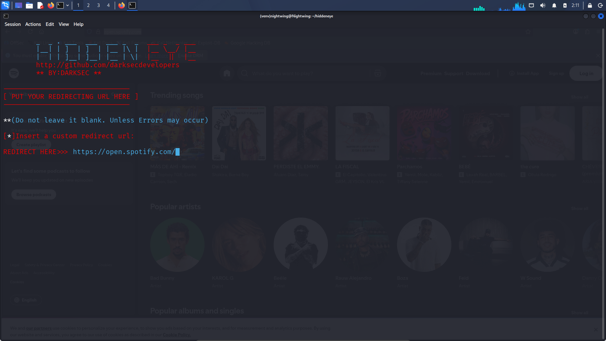
Figura 6 — Configuración de la URL de redirección al sitio legítimo de Spotify.
---
3.3 Despliegue Local
Definición del puerto de red e interfaz de escucha para el servidor de captura.
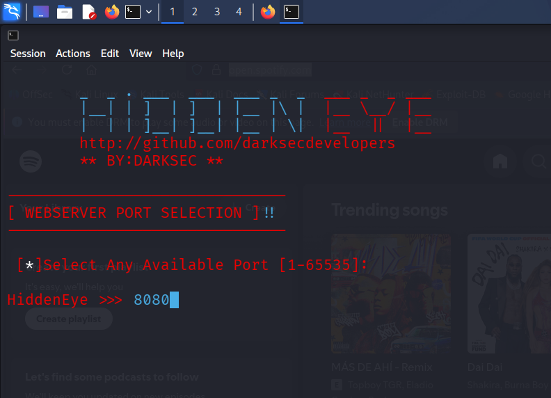
Figura 7 — Selección del puerto de escucha (`8080`).
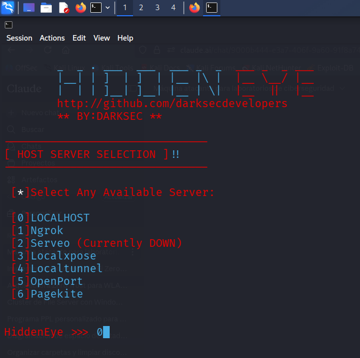
Figura 8 — Selección del servidor local como método de despliegue (opción 0).
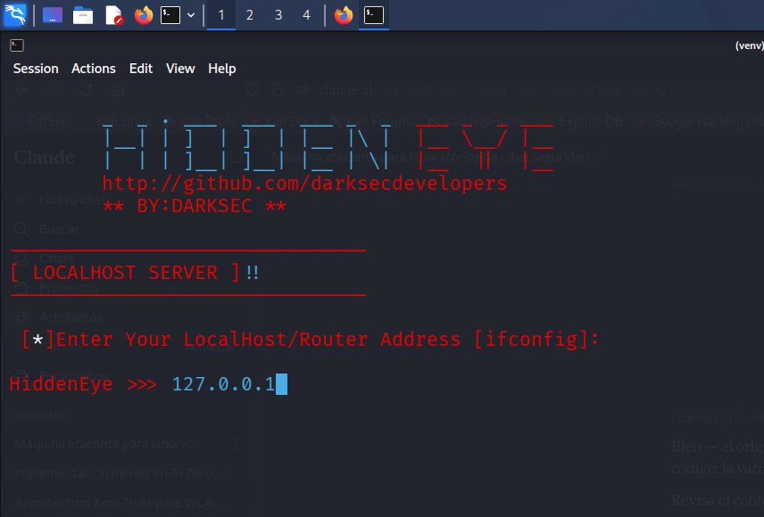
Figura 9 — Servidor activo en `127.0.0.1:8080`.
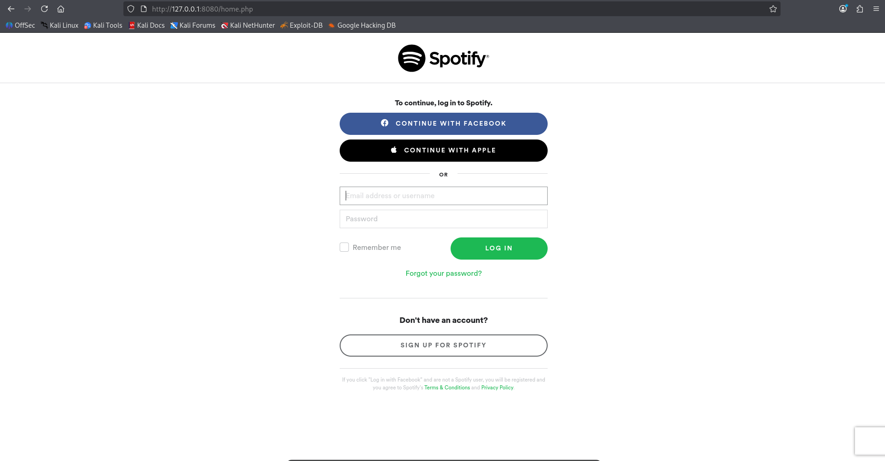
Figura 10 — Página de inicio de sesión de Spotify simulada, accesible en `localhost:8080`.
---
4. Integración con VTXHub y Vortex
Para exponer el servicio hacia una red pública, se utiliza Vortex, un cliente de túnel inverso que redirige el tráfico entrante desde un dominio público hacia el puerto local (`127.0.0.1:8080`).
```
Internet ──► user3700dc4559ce41.app.vtxhub.com ──► 127.0.0.1:8080
```
---
4.1 Obtención del Binario
Descarga del ejecutable desde el panel de control de VTXHub y preparación del entorno.
```bash
unzip vortex.zip
chmod +x vortex
./vortex
```
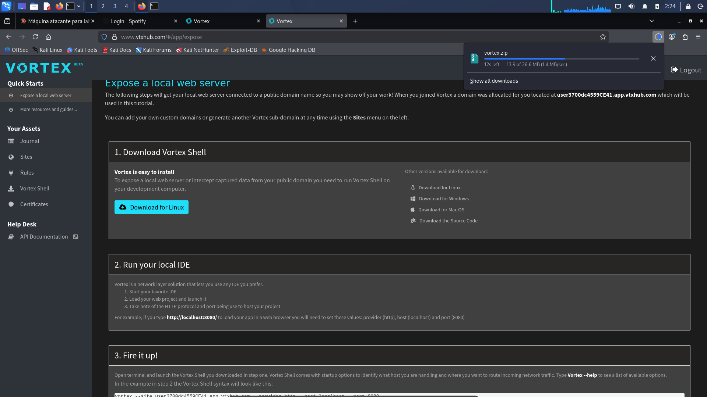
Figura 11 — Descarga del archivo `vortex.zip` desde el panel de VTXHub.
---
4.2 Autenticación
Inicio de sesión en la plataforma VTXHub para habilitar los servicios de tunelización.
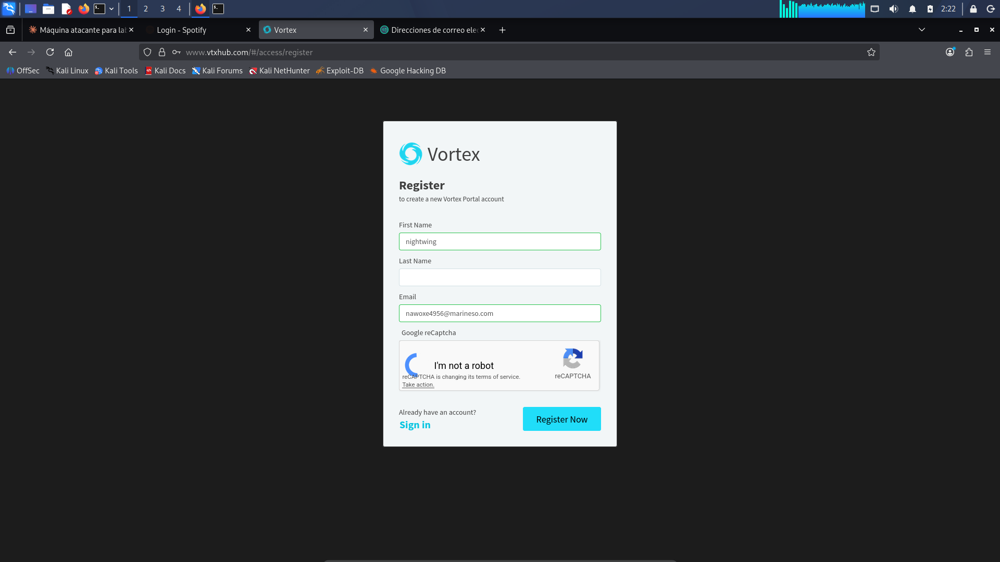
Figura 12 — Autenticación con correo temporal en el cliente Vortex.
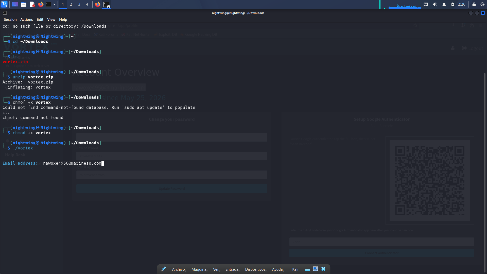
Figura 13 — Panel de Vortex activo con el dominio público generado.
---
4.3 Despliegue y Verificación
Activación del túnel para la visibilidad externa del sitio. Parámetros utilizados:
Parámetro	Valor
Host	`127.0.0.1`
Puerto	`8080`
Protocolo	`http`
Dominio público	`user3700dc4559ce41.app.vtxhub.com`
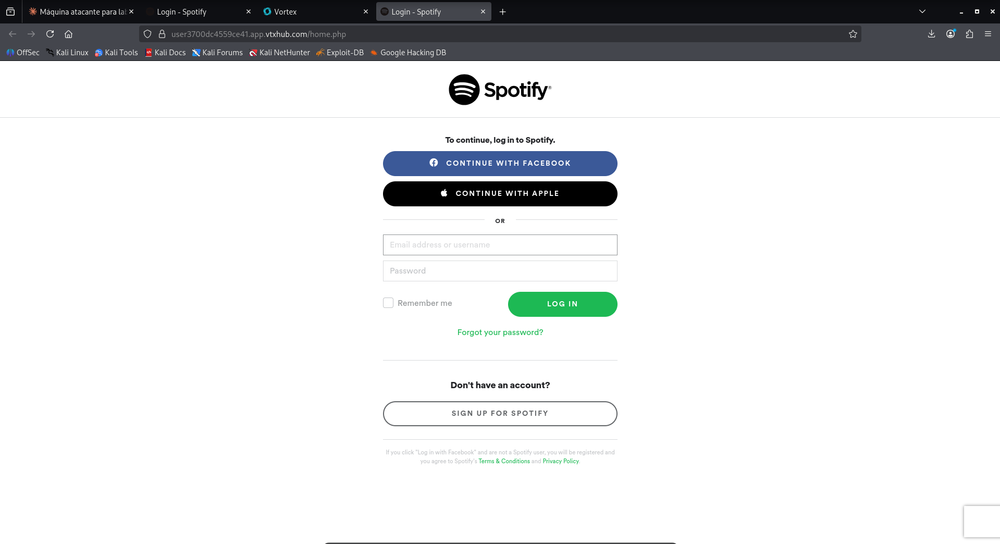
Figura 14 — Página de Spotify simulada accesible vía dominio público de VTXHub.
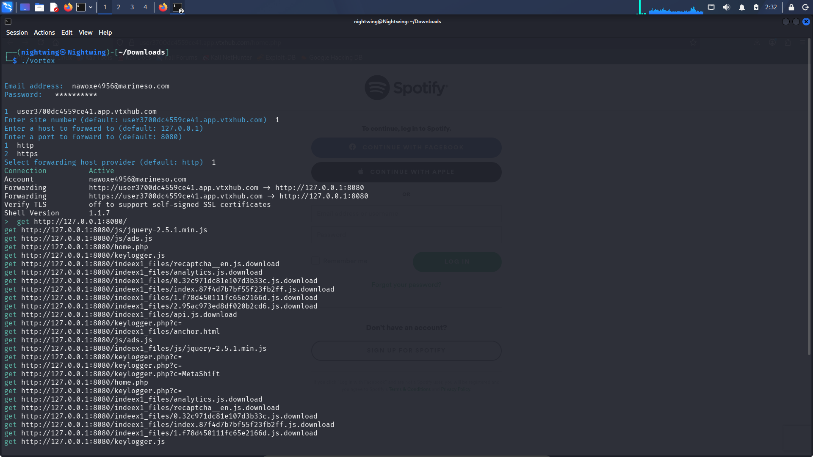
Figura 15 — Túnel activo: tráfico redirigido desde VTXHub hacia `127.0.0.1:8080`.
---
<div align="center">
Conclusiones
Hallazgo	Implicación Defensiva
Alta fidelidad visual de las páginas clonadas	Verificar siempre la URL en la barra de direcciones
Keylogger pre-confirmación de formulario	Implementar autenticación multifactor (MFA)
Redirección transparente post-captura	Capacitar usuarios en detección de phishing
Exposición pública mediante túnel inverso	Monitorear dominios sospechosos y tráfico DNS
---
Laboratorio académico — Universidad Tecnológica de Panamá · Ciberseguridad III · 2026
</div>
